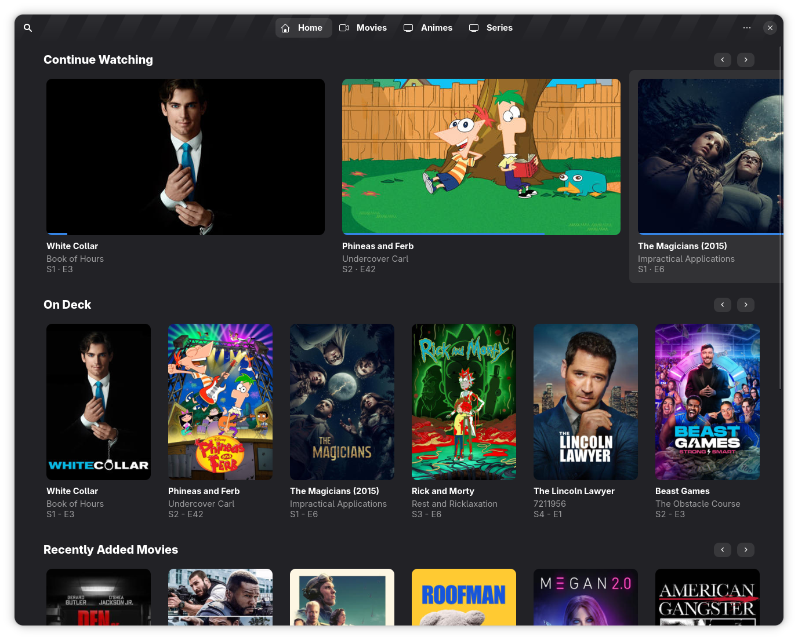

<div align="center">

  <a href="https://github.com/0SkillAllLuck/Scanline">
    
  </a>
  <h2 align="center">Scanline</h2>

  [![Forks][forks-shield]][forks-url]
  [![Stargazers][stars-shield]][stars-url]
  [![Issues][issues-shield]][issues-url]
  [![License][license-shield]][license-url]

  <p align="center">
    Scanline is an <strong>unofficial</strong> native GTK4 / Adwaita client for <a href="https://www.plex.tv">Plex</a>
    <br />
    <a href="#installation"><strong>How to Install »</strong></a>
    <br />
    <br />
    <a href="#features">Features</a>
    &middot;
    <a href="https://github.com/0SkillAllLuck/Scanline/issues/new">Report Bug or Request Feature</a>
    &middot;
    <a href="https://matrix.to/#/%23scanline:skillless.dev">Join the Matrix Room</a>
  </p>
  
  

</div>

## Disclaimer
Scanline is not affiliated with or endorsed by Plex. Scanline is provided as-is without any warranty or guarantees. A Plex account and access to a Plex media server are required.

## Features
- Multi-server support with per-server enable/disable
- Full-text search across servers
- Library browsing by section (Movies, TV Shows, etc.)
- Video playback
  - Fullscreen playback
  - Windowed playback **W.I.P.**
  - P.I.P Support **W.I.P.**
  - Quality presets
  - Audio presets 
  - Subtitles **W.I.P.**
  - Auto-hiding player controls
  - Changing playback speed **W.I.P.**
- Continue watching with progress tracking **W.I.P.**
- Watchlist support **W.I.P.**
- Jellyfin support **W.I.P.**
- EMBY support **W.I.P.**

## About the Project
Scanline is a native, modern looking client for Plex built with GTK4 and Libadwaita in Go. It is designed to fit naturally into the GNOME desktop alongside its existing applications, something web apps and Electron apps often struggle with.

Scanline builds on [Tonearm](https://codeberg.org/dergs/Tonearm)'s [schwifty](https://codeberg.org/dergs/Tonearm/src/branch/main/pkg/schwifty) UI framework, which provides a SwiftUI-inspired approach to building GTK applications in Go.

## Installation
Currently the only tested installation method is the Nix flake provided in the repository. If you want to package this software for another distro or marketplace, please do open an issue so we can coordinate.

### NixOS (Flake)
This assumes that your system configuration is already done using a system flake. First add this repository as an input to your flake.
```nix
inputs = {

    nixpkgs.url = "github:NixOS/nixpkgs/nixpkgs-unstable";

    ... your other inputs ...

    scanline = {
      url = "github:0SkillAllLuck/Scanline";
      inputs.nixpkgs.follows = "nixpkgs";
    };

}
```
then add this anywhere in your system configuration as you see fit
```nix
{ inputs, ... }:

{

  # System Packages
  environment.systemPackages = [
    inputs.scanline.packages.${pkgs.stdenv.hostPlatform.system}.scanline
  ];

  # Or if you prefer via Home Manager
  home.packages = [
    inputs.scanline.packages.${pkgs.stdenv.hostPlatform.system}.scanline
  ];

}
```

## Acknowledgements
The following projects and resources served as inspiration or were helpful during the development of Scanline.
- [Tonearm](https://codeberg.org/dergs/Tonearm) and its [schwifty](https://codeberg.org/dergs/Tonearm/src/branch/main/pkg/schwifty) UI framework for providing the foundation
- [puregotk](https://github.com/jwijenbergh/puregotk) for making this project possible with only minimal CGO bindings
- [Plex](https://www.plex.tv/) for the media server platform
- [Dråfølin](https://drafolin.ch/) for the beautiful icon


[license-shield]: https://img.shields.io/github/license/0SkillAllLuck/Scanline?style=for-the-badge
[license-url]: https://github.com/0SkillAllLuck/Scanline/blob/main/LICENSE
[stars-shield]: https://img.shields.io/github/stars/0SkillAllLuck/Scanline?style=for-the-badge
[stars-url]: https://github.com/0SkillAllLuck/Scanline/stargazers
[forks-shield]: https://img.shields.io/github/forks/0SkillAllLuck/Scanline?style=for-the-badge
[forks-url]: https://github.com/0SkillAllLuck/Scanline/network/members
[issues-shield]: https://img.shields.io/github/issues/0SkillAllLuck/Scanline?style=for-the-badge
[issues-url]: https://github.com/0SkillAllLuck/Scanline/issues
